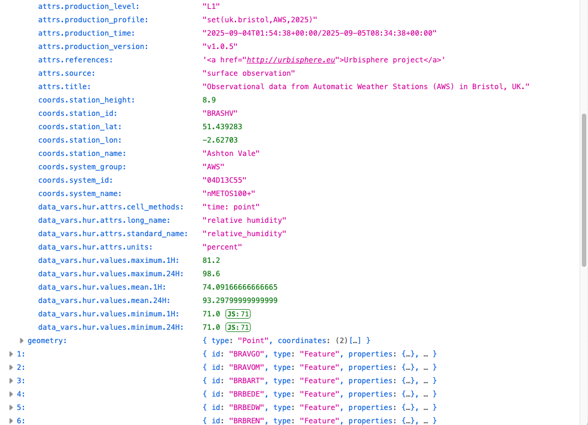
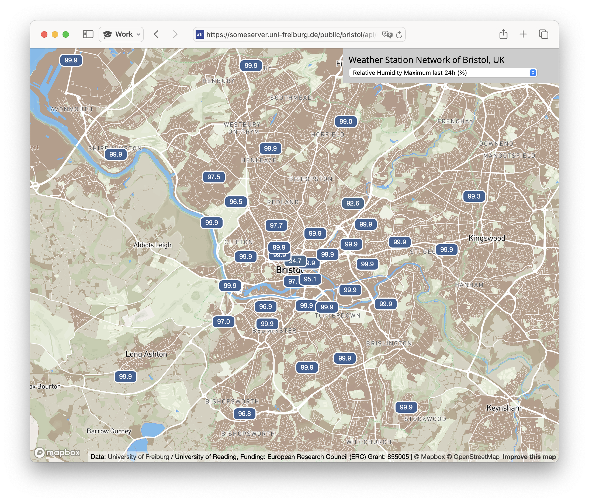
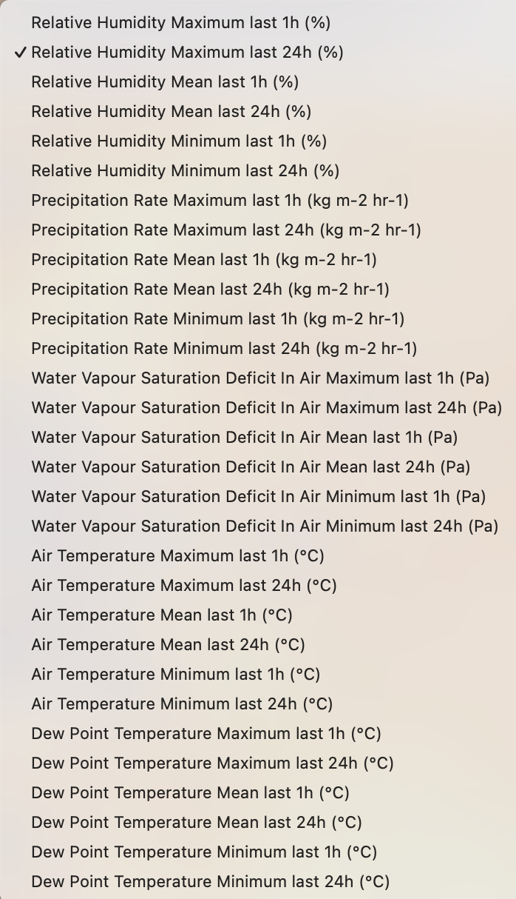
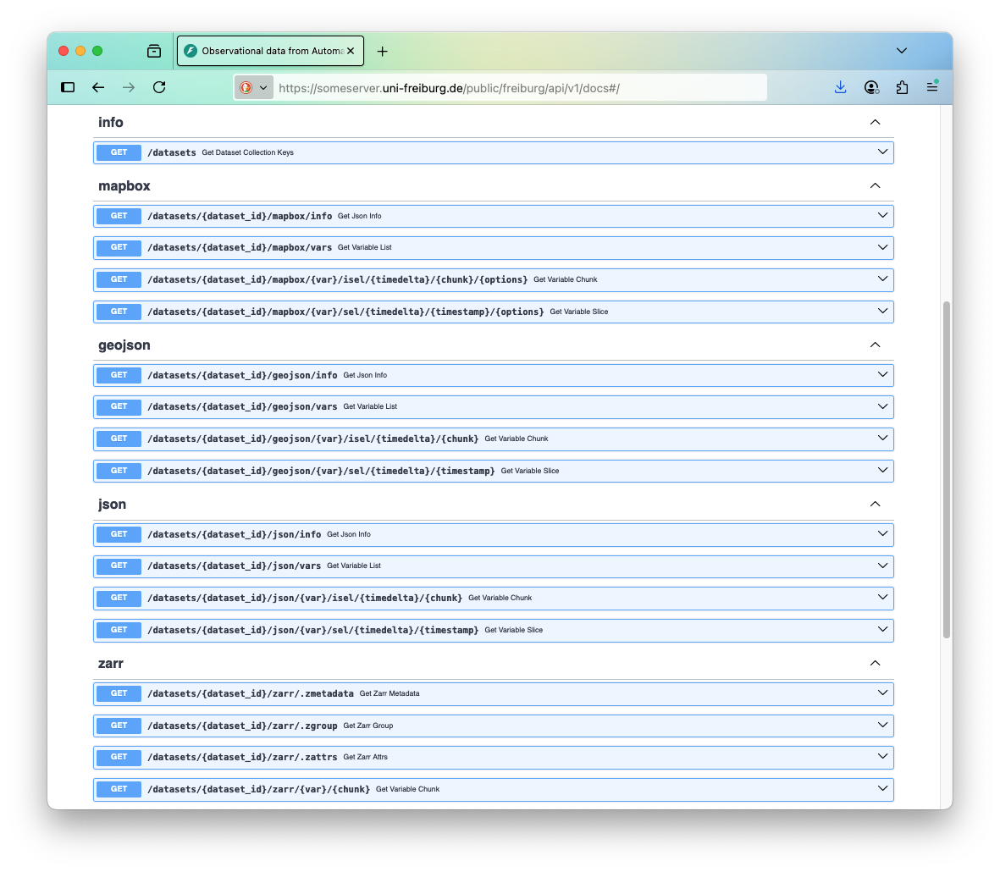

# (urbisphere-dm) interfaces/datasets/api

# Data API

In short, a web stream for datasets.

A data API that builds on `xpublish`, with features added to manage input and output. The `xpublish` module exposes `xarray` datasets via REST API to `fsspec` streams, with quick access to the metadata (consolidated metadata, `coords`) and binary streams for the data (`data_vars`). Its plugin and API model are configurable, added here:

- [x] Catalogues: basic user-access and context management.
- [x] Plugins: extended to handle `json`, `geojson` and `mapbox` output.
- [x] Selection: slicing along the time dimension and selection of variables.
- [x] Caching: extended to read and cache periodically updating sources and repeated queries.

## Rationale

Users in a variety of roles need to monitor and access data alongside as much of the associated metadata as possible. The customised API provides direct access to the production sources, ensuring data provenance while avoiding duplication or redirection of the production workflow. Data managers and end-users access the same database.

## Configuration

By default, all locations found in the default source are exposed as datasets, and named using location shortcode identifiers (`station_id`; {2-char city id}{4-char station id}). Location identifiers are used as a primary index in production files, either as paths in Zarr containers or as groups in NetCDF files. Currently, there is no merged dataset exposed as joining multiple datasets on the fly is too demanding in case coordinates differ between the datasets. User access is managed using combinations of the 'api_name' and 'api_token', more to provide custom context for different users than for security purposes. Filters are implemented using lists for inclusion, for example, to expose only preselected variables (e.g. 'ta', 'hur', etc.).

Example configuration, added during automation:
```toml
[...]

[[datasets_api]]
version.id = 'v1.0.3'

# query
query.cache = true

input.subset.version = "v1.0.5"
input.subset.system_group = "AWS"
input.subset.global_location = "uk.bristol"
input.subset.campaign_location = "BR"

input.path_base = [
 "/srv/meteo/scratch/z--m-n/{system_group}/{version}/data/L1/",
 "/srv/meteo/sandbox/z--m-n/{system_group}/{version}/data/L1/"
]
input.path = [
 "by-source/smurobs/by-location/UK/Bristol/{system_group}/"
]

# local runtime folders
cache.path_base = '../tmp/'
cache.path = "./cache/"

# bristol app
output.path_base = '127.0.0.1:55555'
output.path = '/public/bristol/api/v1/'
```

## Catalogue

The link between input and output is established by registering an output profile with the `catalogue.id` of an input file. One input file can be linked to multiple output profiles.

Example catalogue configuration section, for the API exposing the Bristol AWS data:
```toml
[...]
# CATALOGUE DETAILS

# default
query.system_index = ["system_group=AWS&production_level=L1&production_name=urbisphere&api_name=Bristol-latest&api_token=some-private-code"]

# input files
[[datasets_api.input.file]]
type = "AWS"
path = ""
file = "urbisphere_set(uk.bristol,AWS,{time_bounds})_version(v1.0.5).zarr.zip"
catalogue.id = "urbisphere_set(uk.bristol,AWS,00000000T000000_00000000T480000)_version(v1.0.5)"

[[datasets_api.input.file]]
type = "AWS"
path = ""
file = "urbisphere_set(uk.bristol,AWS,20240517T000000_20250101T000000)_version(v1.0.5).zarr.zip"
catalogue.id = "urbisphere_set(uk.bristol,AWS,20240517T000000_20250101T000000)_version(v1.0.5)"

# catalogue items
[[datasets_api.output.file]]
catalogue.id = "urbisphere_set(uk.bristol,AWS,00000000T000000_00000000T480000)_version(v1.0.5)"
catalogue.api_name = "Bristol-latest"
catalogue.api_token = "some-private-code"
catalogue.system_group = "AWS"
catalogue.production_level = "L1"
catalogue.production_name = "urbisphere"
catalogue.subset.data_vars = ['ta','hur','pr_rate','pwvsd','tdps'] # pr_amount

[[datasets_api.output.file]]
catalogue.id = "urbisphere_set(uk.bristol,AWS,20240517T000000_20250101T000000)_version(v1.0.5)"
catalogue.api_name = "Bristol-2024"
catalogue.api_token = "some-private-code"
catalogue.system_group = "AWS"
catalogue.production_level = "L1"
catalogue.production_name = "urbisphere"
catalogue.subset.data_vars = ['ta','hur','pr_rate','pwvsd', 'tdps'] # pr_amount
```

In the example: Two catalogue items are exposed, accessible by matching `api_name`, `api_token`, `system_group`, `production_level` and `production_name` values in the dataset query. By default (defined in `query.system_index`), the latest data are returned.

### On-demand production
A dependency between datasets in the catalogue is a special case; the final output is modified when a compagnion quality control dataset is registered. Then, both datasets are read and quality flags are applied to mask bad data, and attributes are adjusted according to a lookup of `L2R` production profiles.

## Plugins

By default `xpublish` provides Zarr output. Alternative outputs  are provided for diagnostics and transfer of data.

### JSON

The plugin acts as a wrapper for the built-in export features of xarray. Most JSON encoders and decoders do not handle large objects very well (50–100 MB; limits vary). The API query is validated and results are returned for short periods of time only; by default, maximum one day.

### GeoJSON

The hierarchical structure of the xarray dataset is converted into a flat key-value name space, while attempting to maintain reference to `attrs`, `coords`, `data_vars`. In principle, this name space can be converted back into the original dataset's hierarchy. By default, the output contains a `FeatureCollection` with aggregated statistics (mean, minimum, maximum) for different intervals (one hour, one day) for all variables in the dataset or datasets.

<figure><figcaption>Figure: API geojson</figcaption></figure>


### MapBox

API query to the Mapbox plugin generates a GeoJSON query and embeds the results in HTML, allowing data to be viewed as a map in a web browser. The colour styling is hard-coded, with look-up tables of predefined colour scales for the data overlay.


<figure><div><div><figcaption>Figure: API output</figcaption></figure>

## Selection

In our example above, API calls involve options for selection (and slicing) of data and formats:<br>
`/public/bristol/api/v1/datasets/station_id=BR/mapbox/-/isel/1D/-1/location=BR&variable=ta&period=24H&method=maximum`<br>

- Dataset options: `datasets/station_id=BR`; all locations starting with BR (The Bristol Campaign). Additonal options are appended using URL query string formatting.
- Plugin input options: `mapbox/-/isel/1D/-1/`; to access all variables, chunks of one day periods, counting backwards from the last chunk. These are passed to GeoJSON plugin.
- Plugin output options: `location=BR&variable=ta&period=24H&method=maximum`; the output map selection; here the maximum air temperature in Bristol during the past 24 hours. The options are formatted as URL query string.

<figure><figcaption>Figure: API docs</figcaption></figure>


## Caching

To allow the source files to change dynamically while the API is loaded:

- The sources are converted to Zarr in a filesystem cache location that is updated by a separate process in regular intervals and entirely removed on exit. This step is needed because Zarr handles concurrent access better than NetCDF and the sources are too large for in-memory storage.
- The default in-memory caching implementation in `xpublish` is deactivated. This is partly replaced with a time-of-life caching method, keeping the most frequent API queries.

Without caching, some queries would be slower and more expensive. The MapBox plugin exemplifies such a cached call. First, a MapBox query triggers a GeoJSON query, which requires information to be collected from all paths, groups, variables, and attributes in the source. Secondly, this information is processed to compute relevant statistics in memory before being converted and concatenated as GeoJSON. Finally, the results are used for the map visualisation and embedded in HTML and JavaScript.
